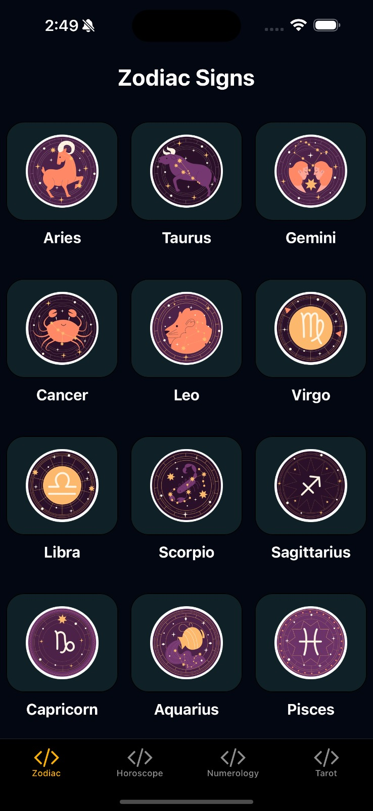
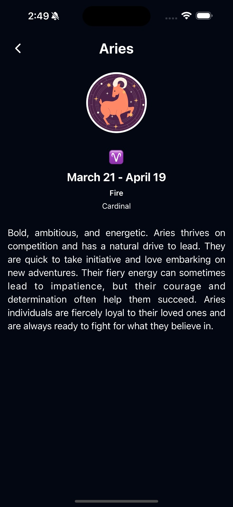
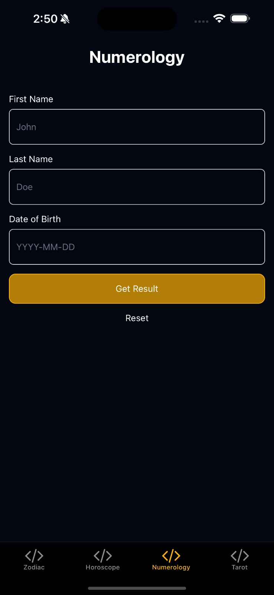
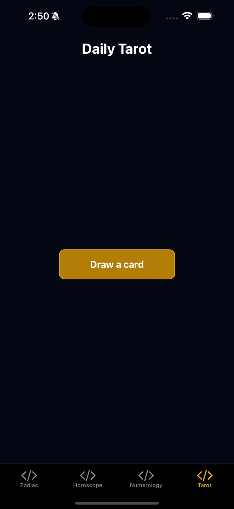

# Astrology Starter App

The **Astrology Starter App** is a React Native application designed to quickly integrate the **Astrology API** by RoxyAPI into your project. With this starter app, you can explore astrology features like zodiac signs, horoscopes, and compatibility directly from your mobile app.

<table>
  <tr>
    <td>
      
    </td>
    <td>
      
    </td>
  </tr>
  <tr>
    <td>
      
    </td>
    <td>
      
    </td>
  </tr>
</table>

## Key Features

- **List Zodiac Signs**: Retrieve a detailed list of all zodiac signs, including their elements, modalities, and symbols.
- **Horoscope Retrieval**: Display daily horoscopes for each zodiac sign.
- **Zodiac Sign Details**: Provide users with in-depth personality traits and characteristics of specific zodiac signs.
- **Compatibility Calculator**: Analyze the compatibility between two individuals based on their zodiac signs and birthdates.
- **Personality Prediction**: Calculate a user's zodiac sign and personality traits from their birthdate and time of birth.

---

## Tech Stack

- **React Native**: Cross-platform mobile application framework.
- **Expo**: Streamlined React Native development environment.
- **TypeScript**: Adds static typing for improved code quality and reliability.
- **React Navigation**: Smooth navigation between app screens.
- **Nativewind**: Tailwind-style utility classes for React Native.

---

## Getting Started

Follow the instructions below to set up and run the Astrology Starter App locally.

### Prerequisites

- Install **Node.js** and **npm** (latest version recommended).
- Have the **Expo CLI** installed. If not, install it using:

  ```bash
  npm install -g expo-cli
  ```

---

### Installation

1. **Clone the Repository**:

   ```bash
   git clone https://github.com/RoxyAPI/astrology-starter-app
   cd astrology-starter-app
   ```

2. **Install Dependencies**:

   ```bash
   npm install
   ```

3. **Set Up Environment Variables**:

   - Duplicate the `.env.sample` file and rename it to `.env`.
   - Update `.env` with your **RoxyAPI Astrology API Token**, available after signing up at [RoxyAPI](https://roxyapi.com).
   - Example `.env` file:

     ```plaintext
     EXPO_PUBLIC_API_URL=https://roxyapi.com/api/v1
     EXPO_PUBLIC_API_TOKEN=your_api_token_here
     ```

   > **Note**: To protect your API token, consider setting up a secure server-side API proxy and routing all requests through it.

---

### Running the App

1. **Start the Expo Development Server**:

   ```bash
   npm start
   ```

   This command launches the Expo server, enabling you to test the app on Android, iOS, or the web.

2. **Platform-Specific Commands**:
   - **Android**: `npm run android`
   - **iOS**: `npm run ios`
   - **Web**: `npm run web`

---

## Features and API Integration

The app includes pre-configured integrations with the **Astrology API**, making it easy to fetch and display astrology-related data. Below are the key endpoints utilized by the app:

1. **List Zodiac Signs**: Fetch metadata about all zodiac signs.
   ```bash
   GET /zodiac/signs?token={your_api_token}
   ```

2. **Zodiac Sign Details**: Retrieve detailed information for a specific sign.
   ```bash
   GET /zodiac/{sign_name}?token={your_api_token}
   ```

3. **Personality Prediction**: Predict a user's personality traits based on their birthdate.
   ```bash
   POST /personality?token={your_api_token}
   ```

4. **Daily Horoscope**: Fetch daily horoscope for a specific zodiac sign.
   ```bash
   GET /horoscope/{sign}?token={your_api_token}
   ```

5. **Compatibility Calculator**: Analyze compatibility between two people.
   ```bash
   POST /compatibility?token={your_api_token}
   ```

---

### Testing

Run tests with the following command:

```bash
npm test
```

The app uses `jest-expo` for a seamless testing experience with Expo.

---

## Contributing

Contributions are welcome! To contribute:

1. Fork the repository.
2. Create a new branch: `git checkout -b feature-name`.
3. Commit your changes: `git commit -m 'Add feature'`.
4. Push to the branch: `git push origin feature-name`.
5. Submit a pull request.

---

## Support

For any questions or issues, refer to the [Astrology API Documentation](https://roxyapi.com/docs/astrology) or contact our support team.

---

Happy coding!
