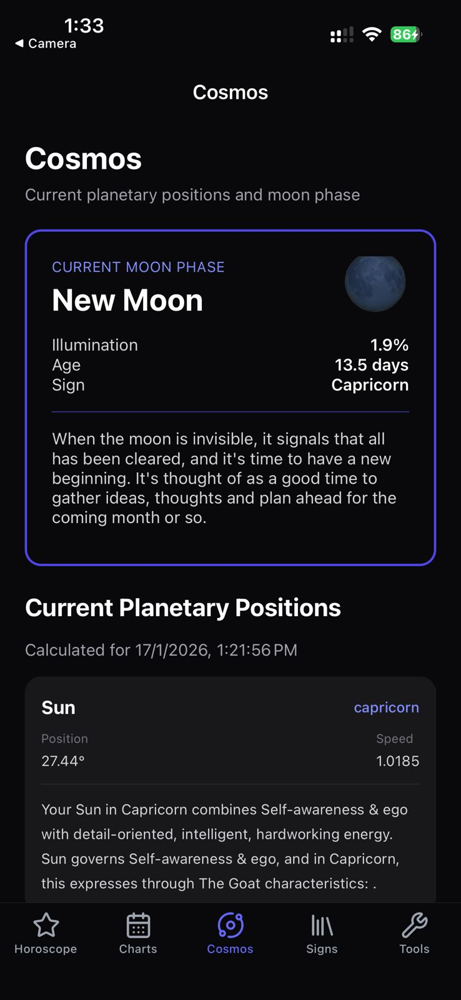
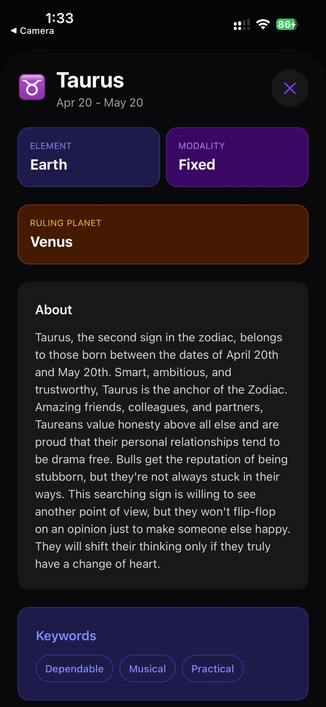
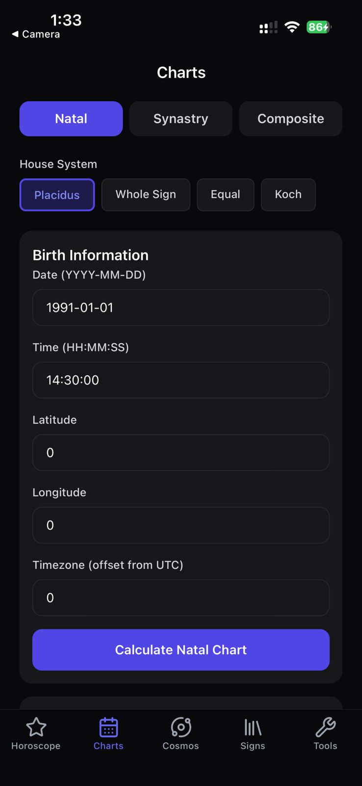
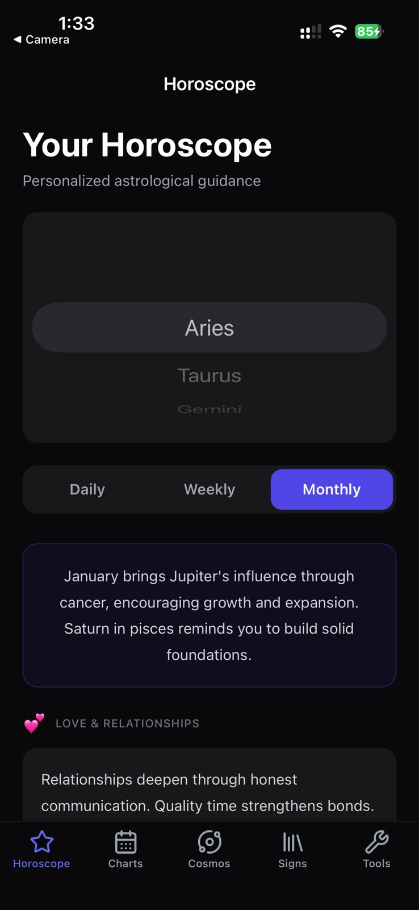
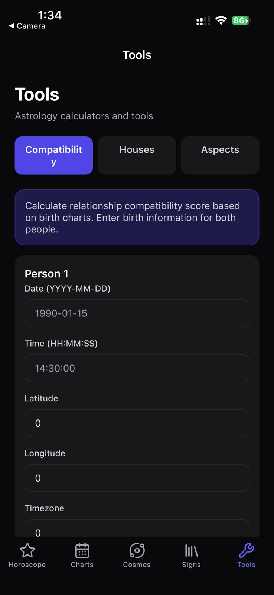

# RoxyAPI Astrology Starter

**Production-ready astrology app template** powered by [RoxyAPI's Western Astrology API](https://roxyapi.com/products/astrology-api). Build professional astrology features in minutes with React Native, Expo, and TypeScript.

## 📸 Screenshots

<div align="center">
  
  
  
  
  
</div>

## 🌟 What You Get

A complete, working astrology app demonstrating key API features:

### 🔮 Horoscopes
- Daily, weekly, and monthly horoscopes
- All 12 zodiac signs
- Love, career, health, finance insights
- Lucky numbers, colors, compatible signs

### 📊 Birth Charts & Compatibility
- Natal chart calculator with planets, houses, aspects
- Synastry analysis for relationship compatibility
- Composite charts for couples
- Compatibility scoring with detailed breakdown

### 🌌 Cosmic Information
- Real-time planetary positions
- Current moon phase with insights
- Complete zodiac signs reference

### 🎯 Built for Developers

- **Type-safe** - Full TypeScript with auto-generated types from OpenAPI
- **Production-ready** - Error handling, loading states, dark mode
- **Customizable** - Clean code you can extend and modify
- **Cross-platform** - iOS, Android, and Web from one codebase

## 🚀 Quick Start

### 1. Get Your API Key

Visit [roxyapi.com/pricing](https://roxyapi.com/pricing) to get instant API access.

### 2. Install & Configure

```bash
# Install dependencies
npm install

# Configure environment
cp .env.example .env
# Add your API key to .env: EXPO_PUBLIC_ROXYAPI_KEY=your_key_here
```

### 3. Run

```bash
npm start        # Start Expo dev server
npm run ios      # Run on iOS simulator
npm run android  # Run on Android emulator
npm run web      # Run in web browser
```

## 📱 Screens Included

| Screen | Features |
|--------|----------|
| **Horoscopes** | Daily/weekly/monthly readings for all signs |
| **Charts** | Natal charts, synastry, composite charts |
| **Cosmos** | Current planet positions, moon phase |
| **Signs** | Complete zodiac signs reference library |
| **Tools** | Compatibility calculator |

## 💻 Usage Example

```typescript
import { astrologyApi } from './src/api';

// Get daily horoscope
const horoscope = await astrologyApi.getDailyHoroscope('aries');

// Calculate natal chart
const chart = await astrologyApi.getNatalChart({
  date: '1990-07-15',
  time: '14:30:00',
  latitude: 40.7128,
  longitude: -74.006,
  timezone: -5,
  houseSystem: 'placidus'
});

// Check compatibility
const compatibility = await astrologyApi.getCompatibilityScore(
  person1Data,
  person2Data
);
```

## 🔧 Customization

This is a **starter template** - modify it to match your needs:

- **Branding**: Update `app.config.ts` and assets
- **Styling**: Modify `tailwind.config.js` and components
- **Features**: Add more API endpoints from [our docs](https://roxyapi.com/docs)
- **UI/UX**: Customize screens in `app/(tabs)/`

## 📚 API Documentation

- **Interactive Docs**: [roxyapi.com/docs](https://roxyapi.com/docs)
- **Pricing**: [roxyapi.com/pricing](https://roxyapi.com/pricing)
- **Support**: [roxyapi.com/contact](https://roxyapi.com/contact)

## 🏗️ Tech Stack

- **Expo SDK 54** - React Native framework
- **TypeScript** - Full type safety
- **NativeWind 4** - Tailwind CSS for React Native
- **openapi-fetch** - Type-safe API client

## 📄 License

This starter template is provided for RoxyAPI customers. See [roxyapi.com/terms](https://roxyapi.com/terms).

---

**Need help?** Check our [documentation](https://roxyapi.com/docs) or [contact support](https://roxyapi.com/contact).

Built by [RoxyAPI](https://roxyapi.com) - Premium data APIs for developers.
